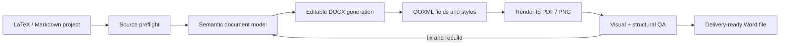

# LaTeX to Word Full

> Turn an academic LaTeX or Markdown project into a genuinely editable Word document — with native equations, live cross-references, publication-style tables, and page-by-page visual QA.

[](SKILL.md)
[](SKILL.md)
[](SKILL.md)
[](references/visual-qa-checklist.md)

## The goal

Most “LaTeX → Word” conversions preserve the words but lose the document.

This skill is designed for the harder version of the problem: a Word file that can still be edited, renumbered, checked, and trusted after conversion.

It treats the manuscript as a structured document rather than a block of text:



## What it preserves

| Area | Functional result |
| --- | --- |
| Equations | Native Word math/OMML whenever the conversion route supports it; no silent rasterization |
| Headings | One numbering source only, avoiding duplicated prefixes such as `4.3. 4.3` |
| Figures | Editable image placement, captions, labels, controlled width, and sensible pagination |
| Tables | Real Word tables with semantic alignment and optional academic three-line borders |
| Cross-references | Word `SEQ`, bookmarks, and `REF` fields instead of frozen numbers |
| Citations | Citation keys mapped to the same numbered bibliography used by the document |
| Pagination | Hidden `keepNext`/`pageBreakBefore` problems detected and corrected |
| Quality assurance | DOCX package validation plus rendered page-by-page inspection |

## Quick start

### Use it as an agent skill

Clone the repository and use the repository root as the skill directory:

```bash
git clone https://github.com/yxccai/latex-to-word-full.git
```

Then ask a compatible agent:

```text
Use $latex-to-word-full to convert my LaTeX project into a fully editable Word document.
Preserve formulas, figures, tables, citations, cross-references, and pagination, then render and verify every page.
```

The main instructions live in [`SKILL.md`](SKILL.md). The skill is intentionally agent-oriented: it tells the agent how to choose a conversion route, when to use a template, how to create live Word fields, and when the result is not faithful enough to claim completion.

### Run the preflight and validator directly

The included scripts are useful even outside Codex:

```bash
python scripts/inspect_latex_project.py path/to/main.tex \
  --json-out build/source-inventory.json

python scripts/validate_docx.py build/manuscript.docx --three-line
```

The first command inventories headings, labels, citations, figures, equations, tables, bibliography keys, and missing assets. The second checks the DOCX package, media relationships, bookmarks, `REF`/`SEQ` fields, table borders, repeated headers, and common structural defects.

## Built for real academic documents

### Live numbering and references

Captions and references are modeled as Word fields:

```text
Caption number  →  SEQ Figure / SEQ Table  →  bookmark
Body reference  →  REF bookmark
Citation        →  REF bibliography bookmark
```

The result can be updated after editing instead of silently keeping stale numbers. When Word has not recalculated fields during generation, update the generated copy with `Ctrl+A`, then `F9`, before the final render.

### Academic tables

For three-line tables, the skill applies:

- a strong top rule;
- a lighter header rule;
- a strong bottom rule;
- no vertical or interior gridlines;
- centered headers and categorical index columns;
- left-aligned prose and right-aligned numeric values;
- repeated headers and protected rows on continuation pages.

Bold formatting never changes a cell’s semantic alignment, so a bold `5` does not suddenly drift away from the other numeric entries.

### Render-based quality control

The conversion is not complete when the DOCX saves successfully. The workflow renders the document to PDF/PNG and checks every page for:

- duplicated heading or caption numbers;
- clipped equations, images, captions, or borders;
- unexplained blank regions after figures and tables;
- headings stranded at page bottoms;
- split short tables and split bibliography entries;
- stale fields, missing media, and font substitutions.

See the [visual QA checklist](references/visual-qa-checklist.md) for the failure signatures and preferred fixes.

## Repository map

```text
.
├── SKILL.md                              # Main agent instructions
├── agents/openai.yaml                    # UI metadata and invocation prompt
├── references/
│   ├── source-and-architecture.md        # Parsing and route selection
│   ├── ooxml-fields-and-layout.md        # Fields, bookmarks, tables, pagination
│   └── visual-qa-checklist.md             # Render-and-review checklist
└── scripts/
    ├── inspect_latex_project.py          # Source inventory and asset preflight
    └── validate_docx.py                  # DOCX structural validation
```

## Supported project shapes

- LaTeX manuscripts with `\input`, `\include`, `\graphicspath`, figures, tables, equations, and `.bib` files;
- Markdown or Quarto manuscripts with headings, images, block/inline math, pipe tables, citations, and footnotes;
- mixed projects where a semantic converter handles ordinary prose and custom OOXML post-processing handles Word-specific behavior;
- conversions based on an existing DOCX template or from a clean academic default when no template is available.

## Honest limitations

No general converter can infer every private macro or personal formatting preference. The skill therefore follows three rules:

1. inspect the source preamble and assets before generating;
2. report unsupported macros, missing files, and renderer limitations;
3. never silently replace editable equations, tables, or references with screenshots or frozen text.

An existing manually formatted DOCX is useful when exact margins, fonts, paragraph spacing, numbering definitions, or table conventions must be matched. Without one, the skill can still produce a coherent publication-style document, but its assumptions should be reported.

## Learn more

- Start with [`SKILL.md`](SKILL.md) for the complete agent workflow.
- Read [`source-and-architecture.md`](references/source-and-architecture.md) when choosing between Pandoc, custom generation, and a hybrid route.
- Read [`ooxml-fields-and-layout.md`](references/ooxml-fields-and-layout.md) when live references, three-line tables, or pagination need precise control.
- Read [`visual-qa-checklist.md`](references/visual-qa-checklist.md) before declaring a conversion complete.

## 中文简介

这是一个面向 Codex 和其他 agent 的通用 LaTeX/Markdown → Word skill。它不仅转换文字，还会处理原生公式、自动编号、文献和图表交叉引用、三线表、图片排版、分页以及最终的逐页截图检查，目标是生成真正可编辑、可维护、可验证的功能完整 Word 文档。
